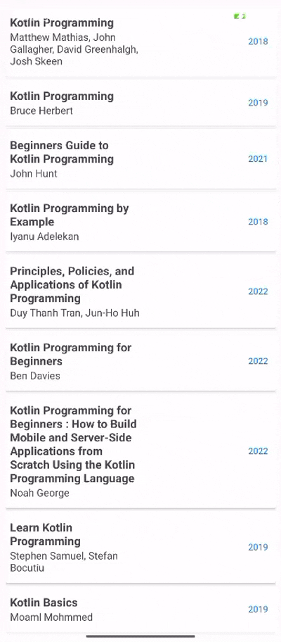

# 🎓 IF Unsoed Mobile  

Aplikasi Android sederhana untuk menampilkan informasi seputar **Program Studi Informatika Universitas Jenderal Soedirman**.  
Dibuat sebagai bagian dari praktikum *Pemrograman Mobile*.  

---

## 👩‍💻 Identitas
- Nama   : Raia Digna Amanda 
- NIM    : H1D023061
- Shift  : C  

---

## 📷 Pertemuan 2  
**Topik:** Pengenalan Android Studio 
### Hasil Screenshot

---

## 🎬 Pertemuan 3  
**Topik:** View Binding & Navigasi 
### Demo Aplikasi  

## 🎬 Pertemuan 4  
**Topik:** Penerapan Arsitektur MVVM dan Networking dengan Retrofit 
### Demo Aplikasi  

---

## 🎬 Pertemuan 5 
**Topik:** Fragment
### Demo Aplikasi  

